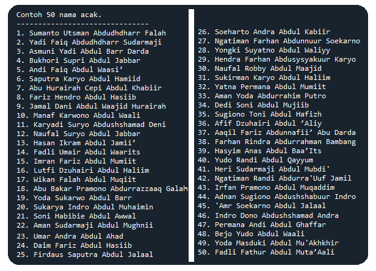

## Pembangkit Nama Acak
###### Developed by [Galih Hermawan](https://galih.eu) | [Blog Medium](https://masgalih.medium.com).
---

Source code untuk membangkitkan nama acak. Data contoh nama disimpan di 4 file plus 1 file untuk menyimpan data nama asmaul husna.
Cek demo online di https://galihboy.github.io/mini_projects/

```
nama_islam.txt
nama_laki.txt
nama_nabi.txt
nama_sahabat_nabi.txt
```

1. Berikut contoh tampilan hasil eksekusi file **libNamaAcak.py** - dapat juga diimpor sebagai modul



2. Untuk pemanggilan lib dicontohkan di file **nama_acak_v4_loop.py**

Berikut screenshot aplikasinya.

